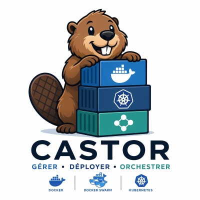

<div align="center">



# Castor

**Gérer · Déployer · Orchestrer**

Open-source, self-hosted, multi-host container orchestration platform — **Docker · Docker Swarm · Kubernetes** under one modern dark UI.

Edited by **LEONARD-IT/GTEK-IT** · Apache-2.0 · ships as a single small Docker image (amd64 + arm64).

</div>

---

Castor is "Portainer, but better": three orchestrators in V1, a modern dark interface, real-time
stats, and **security by default** (local auth + TOTP 2FA, resource-scoped RBAC, full audit log,
protected/system containers, hardened distroless image). It runs as **one container**, talks to the
**local Docker engine** over the mounted socket, and reads Kubernetes through a mounted kubeconfig.

| Orchestrator | V1 scope |
|---|---|
| **Docker** | Full read **+ write** — list/inspect, start/stop/restart/remove, logs, stats, exec, events, images, networks, volumes |
| **Docker Swarm** | **Read-only** — services / nodes / tasks |
| **Kubernetes** | **Read-only** — pods / deployments / nodes (via `client-go` + kubeconfig) |

> Multi-host **Go agents are V2.** The internal `Provider` seam is designed so a remote agent
> becomes "just another provider" with no API/UI rework — but no agent is built in V1.

---

## ⏱️ Quickstart — running in under 2 minutes

You need **Docker** (with the Compose plugin) and `openssl`.

```bash
git clone https://github.com/Yannleonard/Castor.git
cd Castor

# 1) Generate the required 32-byte secret key (64 hex chars).
export CASTOR_SECRET_KEY=$(openssl rand -hex 32)

# 2) Up. (No DOCKER_GID / --group-add needed: Castor's entrypoint detects the
#    Docker socket's group and runs the server as a non-root user automatically.)
docker compose up -d
```

Open **<http://localhost:8080>** → you'll land on the **bootstrap** screen to create the first
admin. Enabling **TOTP 2FA** right after is strongly recommended.

> Prefer not to clone? Pull the published image and run the compose file straight from the repo, or
> run it directly:
>
> ```bash
> docker run -d --name castor \
>   -p 8080:8080 \
>   -e CASTOR_SECRET_KEY=$(openssl rand -hex 32) \
>   -v /var/run/docker.sock:/var/run/docker.sock:ro \
>   -v castor-data:/data \
>   --restart unless-stopped \
>   ghcr.io/yannleonard/castor:latest
> ```
>
> **No `--group-add`.** Castor's entrypoint starts as root only to read the mounted
> socket's group, then drops to a non-root user (uid 65532) **with that group** and
> re-execs the server. For a hardened run that keeps only the capabilities needed
> to perform that drop:
>
> ```bash
> docker run -d --name castor \
>   -p 8080:8080 \
>   -e CASTOR_SECRET_KEY=$(openssl rand -hex 32) \
>   -v /var/run/docker.sock:/var/run/docker.sock:ro \
>   -v castor-data:/data \
>   --read-only --tmpfs /tmp \
>   --security-opt no-new-privileges:true \
>   --cap-drop ALL --cap-add SETUID --cap-add SETGID --cap-add DAC_OVERRIDE \
>   --restart unless-stopped \
>   ghcr.io/yannleonard/castor:latest
> ```

### `CASTOR_SECRET_KEY` — generate it correctly

It is a **32-byte** key (AES-256-GCM, used to seal TOTP secrets). Encode it as **64 hex characters**:

```bash
openssl rand -hex 32      # ✅ 64 hex chars  = 32 bytes
```

> ⚠️ `openssl rand -hex 16` gives only 16 bytes (32 chars) — **wrong**. Castor refuses to start if
> the key doesn't decode to exactly 32 bytes. Keep this key safe: **losing it makes enrolled 2FA
> unrecoverable.**

### Read-only vs read-write Docker socket

The compose file mounts `/var/run/docker.sock` **read-only** by default — enough to **list, inspect,
read logs, and stream stats**, but **not** to start/stop/restart/remove/exec (those need write access
to the socket). For the full Docker lifecycle, switch the mount to `:rw` in
[`deploy/docker-compose.yml`](deploy/docker-compose.yml):

```yaml
    volumes:
      # - /var/run/docker.sock:/var/run/docker.sock:ro     # read-only (default)
      - /var/run/docker.sock:/var/run/docker.sock:rw       # full lifecycle
```

> **Security reality (ADR-003 §7, T1):** write access to the Docker socket is **root-equivalent on
> the host**. Castor's server runs as **non-root** (uid 65532); its entrypoint reads the socket's
> group at startup and drops to that non-root user with the group, so it reaches the socket without
> running the server as root and without a manual `--group-add`. For hardened deployments, front the socket with a scoped
> `docker-socket-proxy` and point `CASTOR_DOCKER_HOST` at it.

### Add Kubernetes (read-only)

Layer the Kubernetes overlay to mount your kubeconfig:

```bash
docker compose \
  -f deploy/docker-compose.yml \
  -f deploy/docker-compose.kube.yml \
  up -d
```

This mounts `~/.kube/config` read-only into the container and sets `CASTOR_KUBECONFIG`. Use a
read-scoped kubeconfig — K8s is read-only in V1. See
[`deploy/docker-compose.kube.yml`](deploy/docker-compose.kube.yml) for caveats (loopback clusters,
path-vs-inline credentials).

---

## ⚙️ Configuration (environment variables)

| Variable | Required | Default | Purpose |
|---|:---:|---|---|
| `CASTOR_SECRET_KEY` | ✅ | — | 32-byte key (64 hex chars) for AES-256-GCM. Refuses to start if unset / not 32 bytes. |
| `CASTOR_HTTP_ADDR` | | `:8080` | Listen address inside the container. |
| `CASTOR_DB_PATH` | | `/data/castor.db` | SQLite database file (on the `/data` volume). |
| `CASTOR_DOCKER_HOST` | | (socket) | Override the Docker endpoint (e.g. a socket-proxy `tcp://…`). |
| `CASTOR_KUBECONFIG` | | — | Path to a mounted kubeconfig (set by the kube overlay). |
| `CASTOR_TRUST_PROXY` | | `false` | Honor `X-Forwarded-Proto`/`-For` (set `true` only behind a trusted TLS proxy). |
| `CASTOR_SELF_CONTAINER_ID` | | (auto) | Self-protection hint; also resolved at runtime from `/proc/self/cgroup`. |
| `CASTOR_BOOTSTRAP_TOKEN` | | — | Optional token to gate `POST /api/v1/bootstrap` for unattended installs. |

A copy-paste template lives in [`deploy/env.example`](deploy/env.example). To use a `.env` file:

```bash
cp deploy/env.example .env      # edit CASTOR_SECRET_KEY at minimum
docker compose --env-file .env up -d
```

---

## 🔐 Security highlights

- **Local auth + TOTP 2FA** (argon2id password hashing; TOTP secret AES-256-GCM-sealed at rest).
- **Resource-scoped RBAC** with built-in `admin` / `operator` / `viewer` roles, scope-aware for V2.
- **Full audit log** — every mutating action writes exactly one append-only row.
- **Protected containers** — Castor's own container and the `/data` volume can **never** be removed
  via the UI (even by admins); containers labelled `io.castor.protected="true"` are guarded too.
- **Hardened image** — distroless `static:nonroot` (uid 65532), no shell, no libc, read-only rootfs
  in compose, all capabilities dropped, `no-new-privileges`.
- **CI gates** — `golangci-lint`, `go test -race`, vitest, and `govulncheck` on every push/PR.

Full threat model & operational guidance: [`docs/runbooks/security.md`](docs/runbooks/security.md).

---

## 🏗️ Architecture & build

Castor is **one static Go binary** that serves the JSON/WebSocket API **and** the React UI (embedded
via `embed.FS`) on a single port. SQLite (`modernc.org/sqlite`, pure Go) is the only datastore;
live cluster state is never persisted — it is fetched on demand and cached in memory.

The image is a **three-stage** build:

```
ui    (node:24-alpine)            ── vite build ──▶  /server/web/dist  (React static assets)
build (golang:1.23-alpine)        ── copies dist into the embed path, then
                                     CGO_ENABLED=0 go build ──▶ /usr/local/bin/castor
final (distroless/static:nonroot) ── ships only the binary; non-root; no shell; no libc
```

**Embed-path contract (must stay in lockstep):** the UI's `vite.config.ts` sets
`build.outDir = "../server/web/dist"`, the Go side uses `//go:embed dist` in `server/web/embed.go`,
and the Dockerfile copies the built dist into `server/web/dist` **before** `go build`. A placeholder
`server/web/dist/index.html` is committed so a bare `go build` never fails the embed.

### Build it yourself

> Go is **not** required on your host — it is compiled inside the Docker build.

```bash
# Linux/macOS
./build.sh build      # buildx the image for your arch and load it
./build.sh run        # docker compose up -d  (needs CASTOR_SECRET_KEY)

# Windows (PowerShell 7+)
$env:CASTOR_SECRET_KEY = (openssl rand -hex 32)
./build.ps1 build
./build.ps1 run

# Make (Unix), with a local Go + Node toolchain:
make build            # UI -> embed -> static Go binary
make docker-build     # buildx local-arch image
make docker-push      # buildx multi-arch (amd64+arm64) push to GHCR
make verify           # golangci-lint + go test -race + govulncheck
```

Multi-arch images (`linux/amd64`, `linux/arm64`) are published to
`ghcr.io/gtek-it/castor` by [`.github/workflows/release.yml`](.github/workflows/release.yml) on a
`v*.*.*` tag.

---

## 🩺 Health & operations

- **Healthcheck:** the image has no shell/curl, so health is the binary's own subcommand —
  `castor healthcheck` performs `GET /api/v1/healthz` on the local listener and exits `0`/`1`. Both
  the Dockerfile `HEALTHCHECK` and the compose `healthcheck` use it.
- **Data & backup:** everything persistent lives in `/data/castor.db` on the `castor-data` volume.
  Back it up by copying that file (SQLite WAL mode):
  ```bash
  docker run --rm -v castor-data:/data -v "$PWD:/backup" busybox \
    sh -c 'cp /data/castor.db /backup/castor-$(date +%Y%m%d).db'
  ```
- **Logs:** `docker logs castor` (structured JSON; secrets are redacted before logging).
- **Upgrade:** `docker compose pull && docker compose up -d` — the DB on `/data` persists; schema
  migrations run automatically on startup.

More: [`docs/runbooks/install.md`](docs/runbooks/install.md).

---

## 📚 Documentation

- Install & operations — [`docs/runbooks/install.md`](docs/runbooks/install.md)
- Security & threat model — [`docs/runbooks/security.md`](docs/runbooks/security.md)
- Architecture decisions — [`docs/adr/`](docs/adr/)
- Contributing — [`CONTRIBUTING.md`](CONTRIBUTING.md)

## 🤝 Contributing

Contributions are welcome — see [`CONTRIBUTING.md`](CONTRIBUTING.md). Castor is **100% from scratch**
and self-contained; it depends on no other repository.

## 📄 License

[Apache-2.0](LICENSE) © 2026 LEONARD-IT/GTEK-IT.
